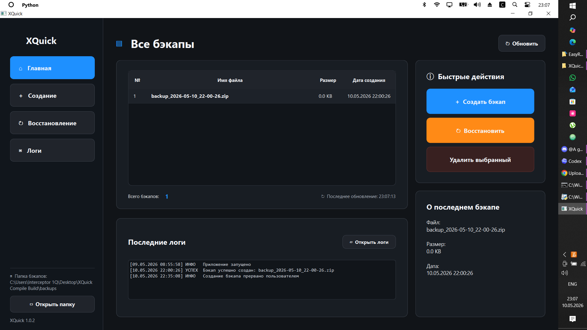
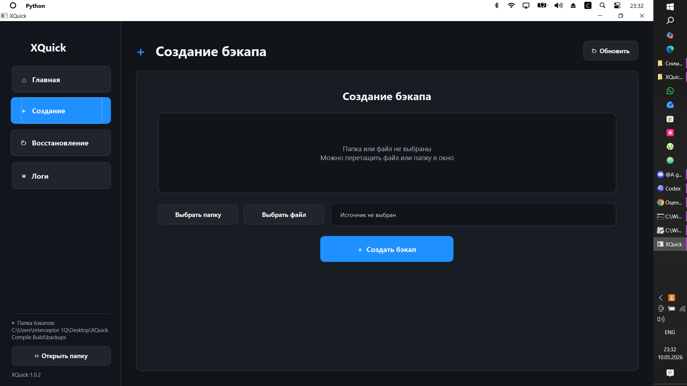
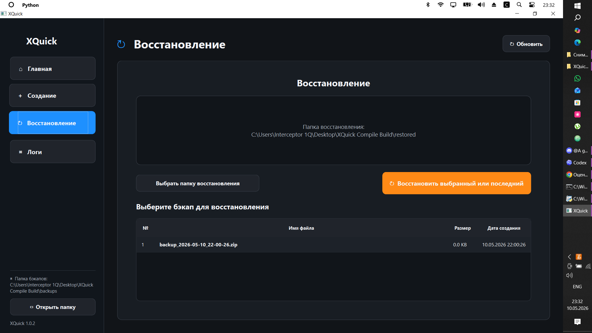
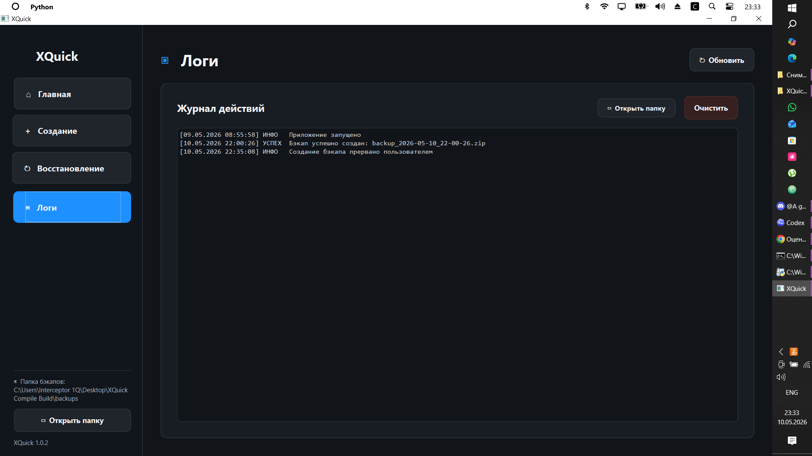

# XQuick

<p align="center">
  
</p>

<h1 align="center">XQuick v1.1.0 Release latest</h1>

<p align="center">
  Fast and simple backup utility with GUI interface.
</p>

<p align="center">
  
  
  
  
  
</p>

---

## About

**XQuick** is a lightweight desktop utility designed for creating and restoring backups through a clean graphical interface.

The project is an evolution of **EasyReserve**, bringing backup management from CLI to a faster and more user-friendly GUI experience.

The main goal of XQuick is to make local backup management simple, fast, and convenient.

---

## Features

✅ Quick backup creation  
✅ Easy backup restoration  
✅ Delete old backups  
✅ Logging system  
✅ Simple graphical interface  
✅ Folder selection dialog  
✅ Drag & Drop support *(if enabled)*  
✅ Lightweight and fast

---

## Screenshots

### Main Window

<p align="center">
  
</p>

### Backup Creation

<p align="center">
  
</p>

### Restore Section

<p align="center">
  
</p>

### Logs

<p align="center">
  
</p>

---

## Installation

### Clone repository

```bash
git clone https://github.com/YG-Deaq17/XQuick.git
cd XQuick
```

### Install dependencies

```bash
pip install -r requirements.txt
```

### Run application

```bash
python XQuick.py
```

---

## Requirements

- Python **3.10+**
- Windows OS
- Dependencies from `requirements.txt`

---

## Project Structure

```text
XQuick/
│── assets/
│   ├── icon.png
│   ├── main.png
│   ├── backup.png
│   ├── restore.png
│   └── logs.png
│
│── logs/
│── XQuick.py
│── requirements.txt
│── README.md
│── LICENSE
```

---

## Why XQuick?

XQuick was created to simplify backup management through a graphical interface.

Instead of manually copying files or using complicated commands, XQuick provides a fast and convenient way to create, restore, and manage backups.

---

## Roadmap

- [x] Backup creation
- [x] Restore system
- [x] Logging support
- [x] GUI interface
- [x] Portable version
- [x] Analizyng backups
- [x] English language
- [x] Choose of Themes
- [ ] Scheduled backups -> In development...


---

## Related Projects

### EasyReserve
CLI-based backup utility.

### XionShell
Experimental shell environment project.

---

## License

This project is released under **The Unlicense**.

You are free to use, modify, distribute, and share this software without restrictions.

---

<p align="center">
Made with ❤️ by Deaq
</p>
